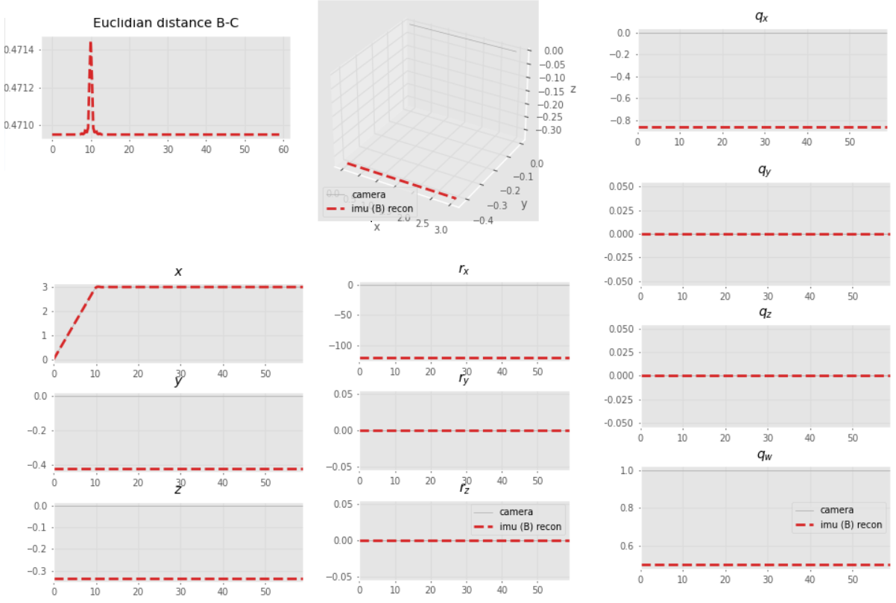
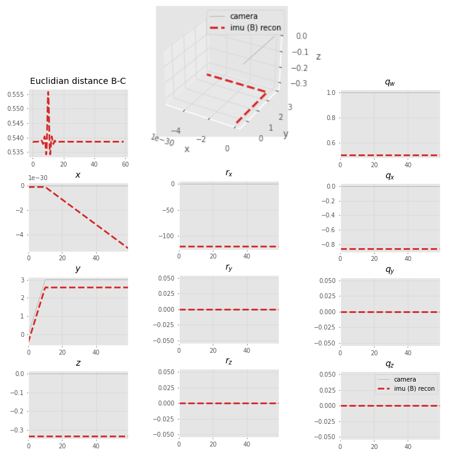
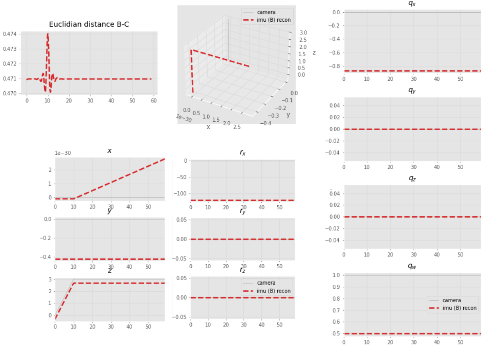
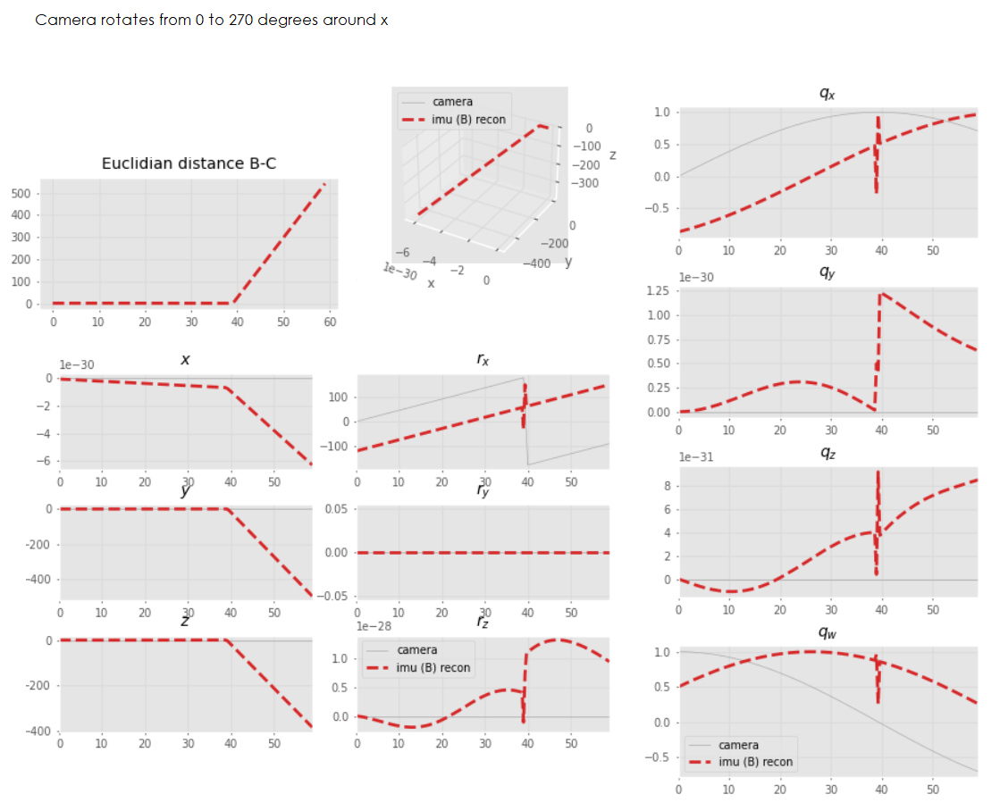
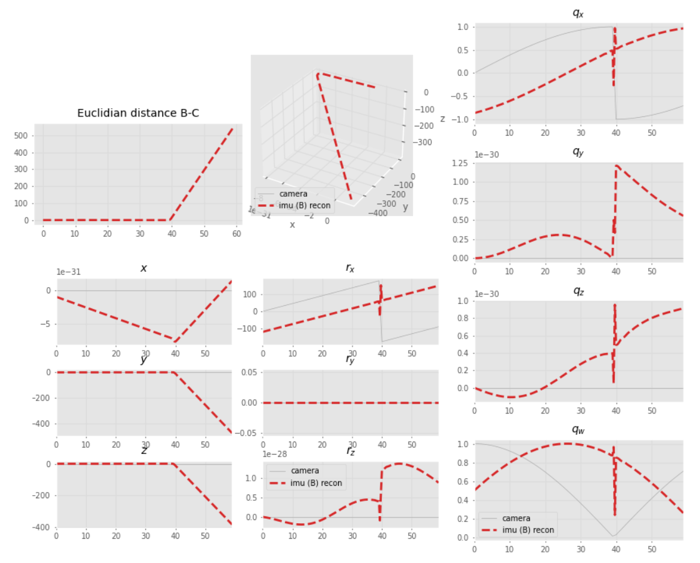
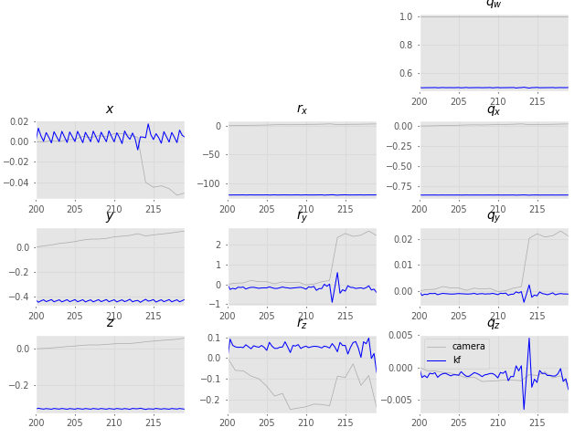

# DVI-EKF
Implementation of a loosely-coupled VI-ESKF SLAM to estimate
the calibration parameters in a camera-IMU sensor probe setup.

[Program outline](https://www.evernote.com/l/AeQSiL2U6txCWbgNAi1G9mUtWune-gjHNlU/)

## Simple camera trajectory
```
python3 cam_fake_traj.py # for generating a simple trajectory
python3 simple_robot.py <regen/noregen> <plot/noplot>
```

Camera moves in x  


Camera moves in y  
 

Camera moves in z  


Camera rotates around its x-axis (90 deg)  


Camera rotates around its x-axis (270 deg)  


Camera rotates around its x-axis (270 deg -- constrained `q_w` to be positive)  


## Filter


- [ ] Shown are IMU positions and rotations, I still need to work on
proper plot functions for the rest of the states.
- [ ] Equations/Jacobian stuff still needs checking.

## Probe
```
python3 vsimpleprobe.py
```
Unconstrained SLAM end | Constrained SLAM end
--- | ---
 | 

## Fake IMU data generation
```
python3 simple_robot.py regen plot
```


Generated fake IMU data based on kinematics relations between
the camera and the IMU. Shown here: for the first 50 camera values.


## Table of contents
* [Probe](#probe)
* [Simple camera trajectory](#simple-camera-trajectory)
* [Filter](#filter)
* [Fake IMU data](#fake-imu-data-generation)
* [Old tests](/old-tests)
