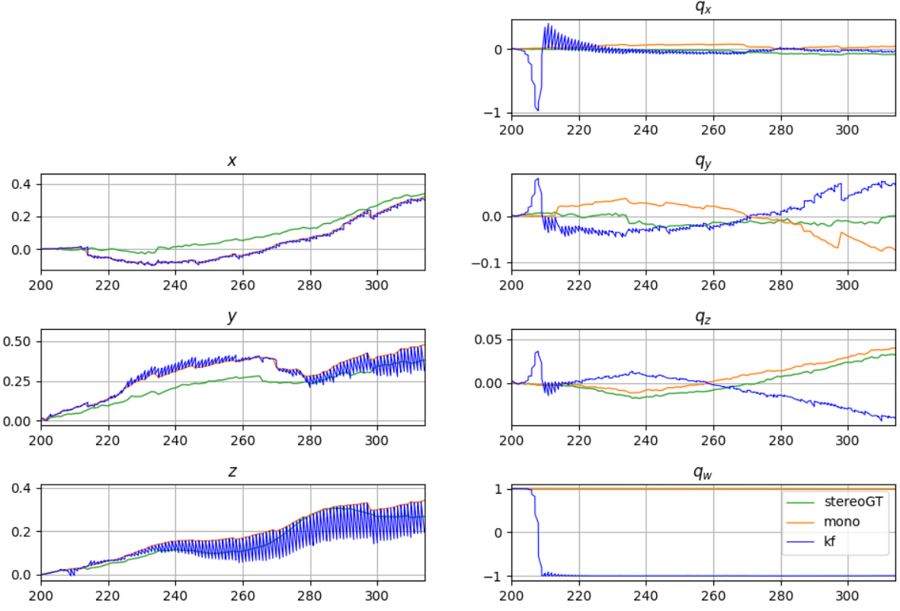
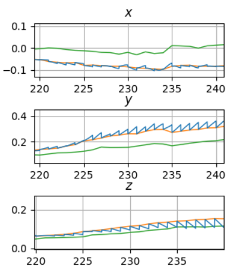
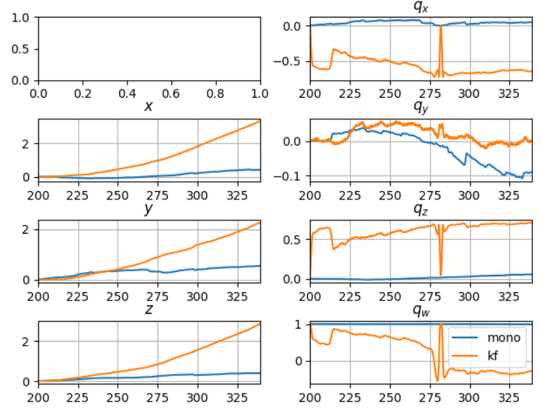
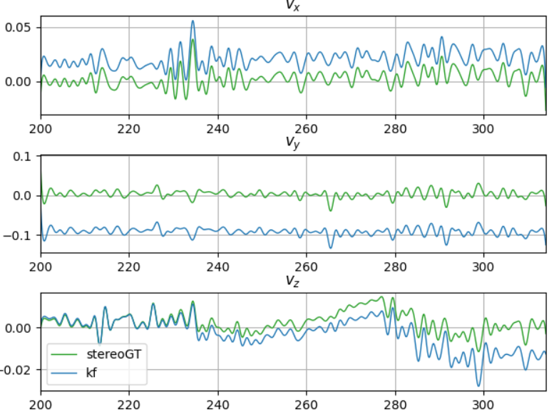
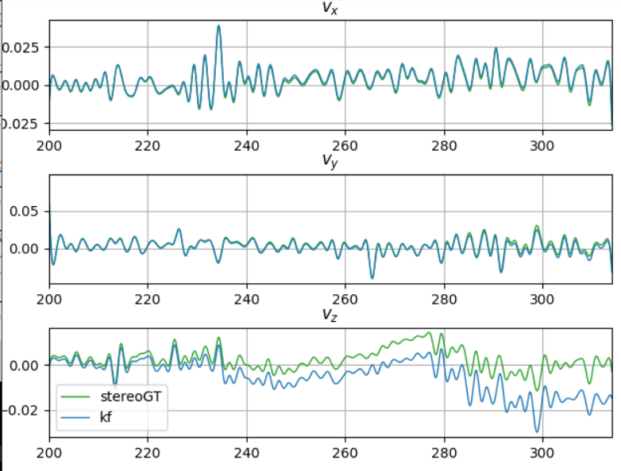

# DVI-EKF
Implementation of a loosely-coupled VI-SLAM.
Based on .

## Table of contents
* [Current status (of the filter)](#current-status-of-the-filter)
* [Preliminaries/Tests](#preliminariestests)
  * [Comparing velocities](#comparing-velocities)
  * [KF propagation only](#kf-propagation-only)
* [Old tests](/tests)
  * [Offline trajectories](/tests#offline-trajectories)
  * [Fake IMU data](/tests#fake-imu-data)
  * [Reconstructed visual trajectory](/tests#reconstructed-visual-trajectory)

------

## Current status (of the filter)
```
python3 main.py
```


Not working, something's wrong...

Pictured: KF with both propagation and update steps; **non-noisy IMU**
for the time being.




-----

## Preliminaries/Tests
### KF propagation only
Using initial pose from monocular trajectory and propagating using IMU values
(**not noisy**).

Currently, propagation equations seem to check out for the quaternions!
Pictured: after correcting the initial values for the velocity `v0`:



### Comparing velocities
Tried to compare
* velocities from the stereo trajectory (from numerical differentation of x, y, z)
* velocities from kalman filter (propagation only, IMU without noise)



Corrected the offset by setting the initial values v0 in the Kalman filter
to the initial values from the stereo trajectory.

(Previously `v0 = [0., 0., 0.]`, now `v0 = [stereoGT_traj.vx[0], stereoGT_traj.vy[0], stereoGT_traj.vz[0]]`)



