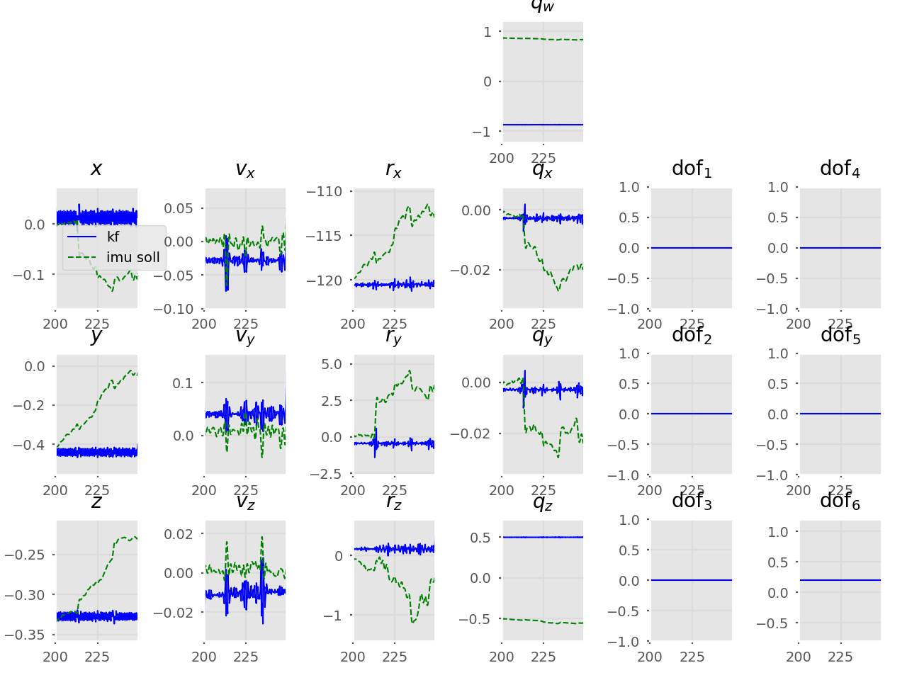
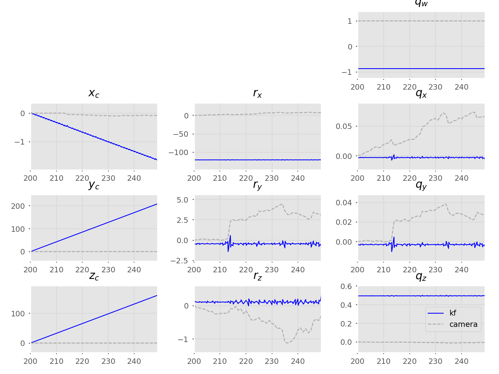

# DVI-EKF
Implementation of a loosely-coupled VI-ESKF SLAM to estimate
the calibration parameters in a camera-IMU sensor probe setup.

[Program outline](https://www.evernote.com/l/AeQSiL2U6txCWbgNAi1G9mUtWune-gjHNlU/)

## Current results



## Probe
```
python3 vsimpleprobe.py
```
Unconstrained SLAM end | Constrained SLAM end
--- | ---
 | 

## Table of contents
* [Probe](#probe)
* [Current results](#current-results-propagation-only)
* [Old tests](/old-tests)
