# DVI-EKF
Implementation of a loosely-coupled VI-ESKF SLAM to estimate
the calibration parameters in a camera-IMU sensor probe setup.

[Program outline](https://www.evernote.com/l/AeQSiL2U6txCWbgNAi1G9mUtWune-gjHNlU/)

## Usage
### Running the program
```
python3 main.py <prop/update> <const_dofs> <Rpval>
```
* arg1: `prop` for propagation only, anything else to perform prop + update
* arg2: `cdofs` or `const_dofs` to make probe have constant dofs, anything else otherwise
* arg3: (_optional_) sets value for `R_p`, defaults to `1e2`

### Changing the noise values
* [Process noise - IMU](https://github.com/feudalism/dvi-ekf/blob/95afc6e5996ef68fc3ec3b39d4f063dd8248ce6e/generate_data.py#L35)
* [Process noise - DOFs](https://github.com/feudalism/dvi-ekf/blob/95afc6e5996ef68fc3ec3b39d4f063dd8248ce6e/Filter/Filter.py#L207)
* [Measurement noise](https://github.com/feudalism/dvi-ekf/blob/95afc6e5996ef68fc3ec3b39d4f063dd8248ce6e/main.py#L33)

### Setting the Kalman gain plotter
Adjust the arguments in [this line](https://github.com/feudalism/dvi-ekf/blob/95afc6e5996ef68fc3ec3b39d4f063dd8248ce6e/main.py#L40)
as necessary.  
e.g. `min_row, min_col = 0` and `max_row, max_col = 3` will plot the gain matrix entries `K[0:3,0:3]`.

Optional: for plot labels, the boolean option `index_from_zero` [can be set](https://github.com/feudalism/dvi-ekf/blob/95afc6e5996ef68fc3ec3b39d4f063dd8248ce6e/main.py#L85).

## Current results
### Trajectory from monocular SLAM propagation
P + U | P + U | P + U
---   | ---   | --- |
`stdev_a, stdev_om = 1e-3`  | `stdev_a, stdev_om = 1e-3` | `stdev_a, stdev_om = 1e-3`  
**`cov_p = 1000`** | **`cov_p = 0.1`**  | **`cov_p = 1e-6`**
`cov_q = 0.05` | `cov_q = 0.05` | `cov_q = 0.05`
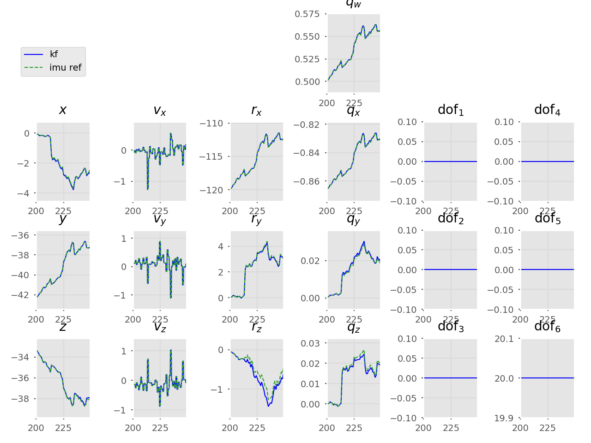 | 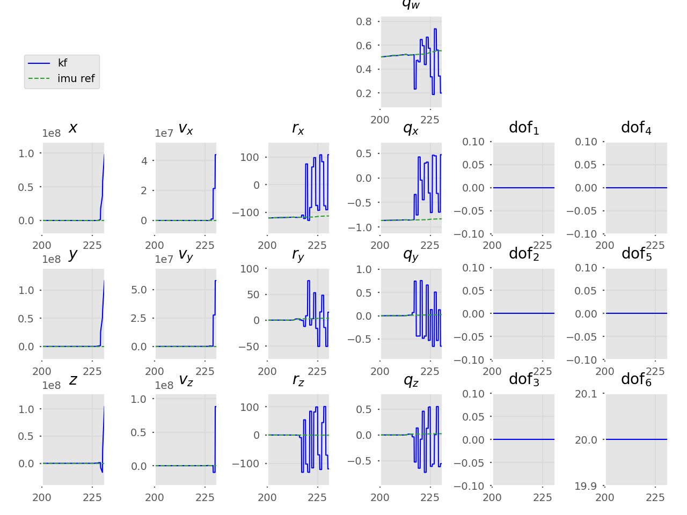 | 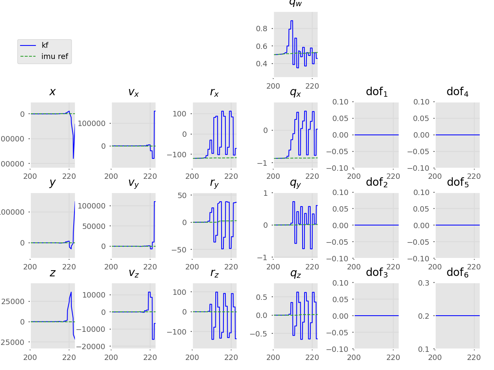
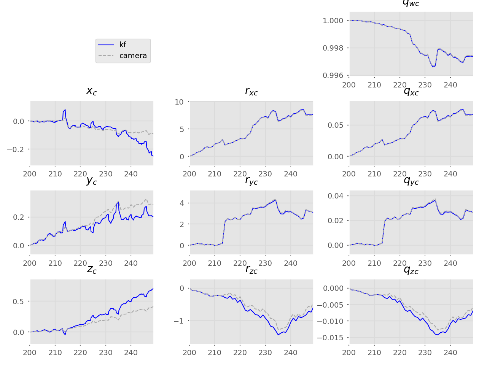 | 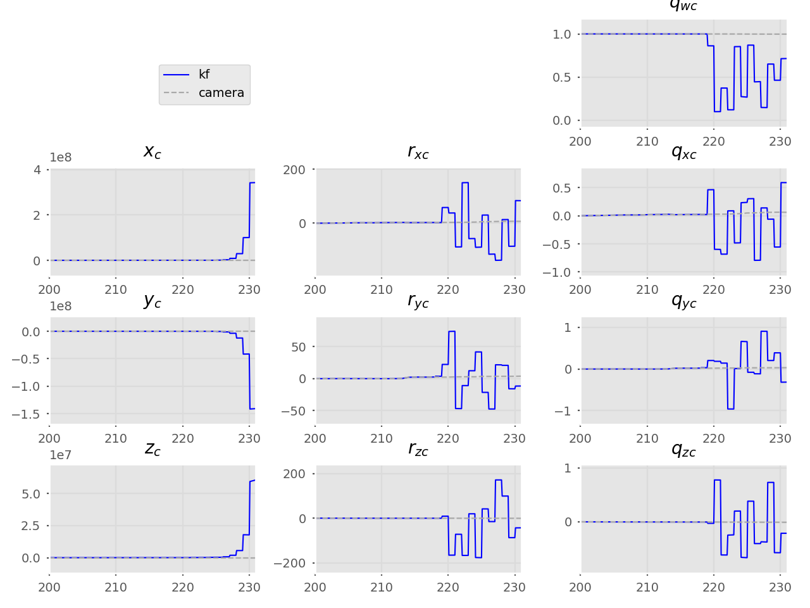 | 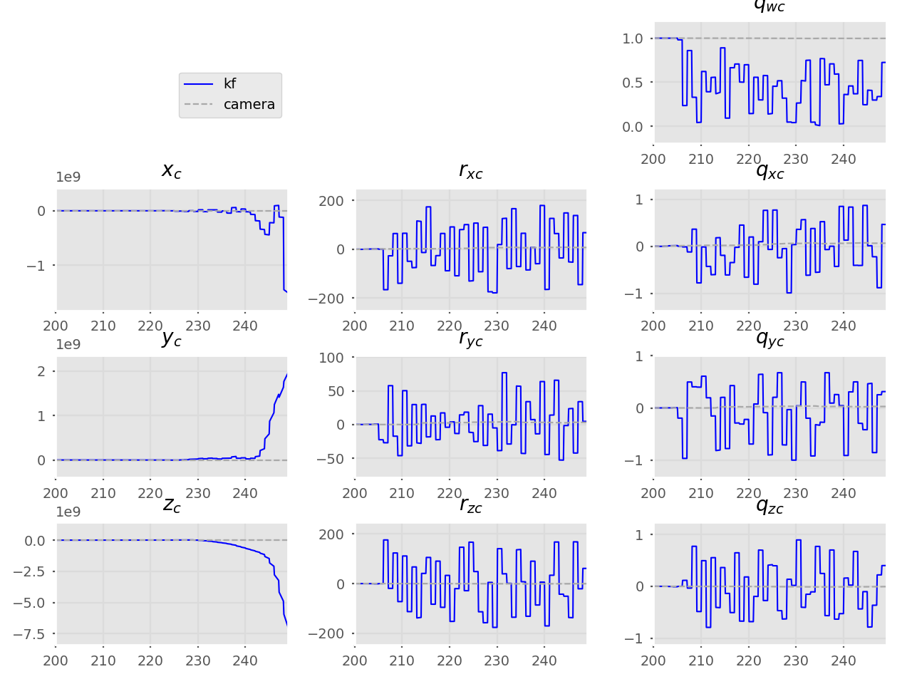

### Monocular SLAM trajectory
P only  | P + U | P + U | P + U
---     | ---   | ---   | --- |
&nbsp;  | `stdev_a, stdev_om = 1e-3`  | `stdev_a, stdev_om = 1e-3` | `stdev_a, stdev_om = 1e-3`  
&nbsp;  | **`cov_p = 1000`** | **`cov_p = 0.1`**  | **`cov_p = 1e-6`**
&nbsp;  | `cov_q = 0.05` | `cov_q = 0.05` | `cov_q = 0.05`
 |  |  | 
 |  |  | 

### Simple trajectory
Camera moves in x direction, no rotations.

P only  | P + U | P + U 
---     | ---   | ---   
&nbsp;  | `stdev_a, stdev_om = 1e-3`  | `stdev_a, stdev_om = 1e-3` 
&nbsp;  | **`cov_p = 1000`** | **`cov_p = 0.1`**
&nbsp;  | `cov_q = 0.05` | `cov_q = 0.05` 
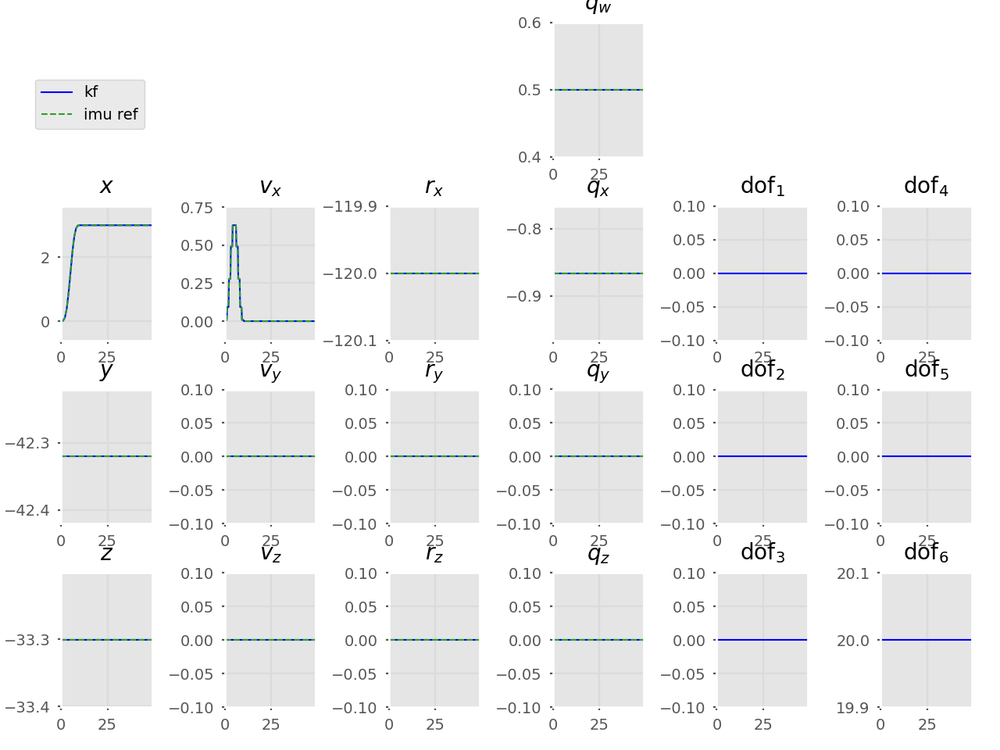 | 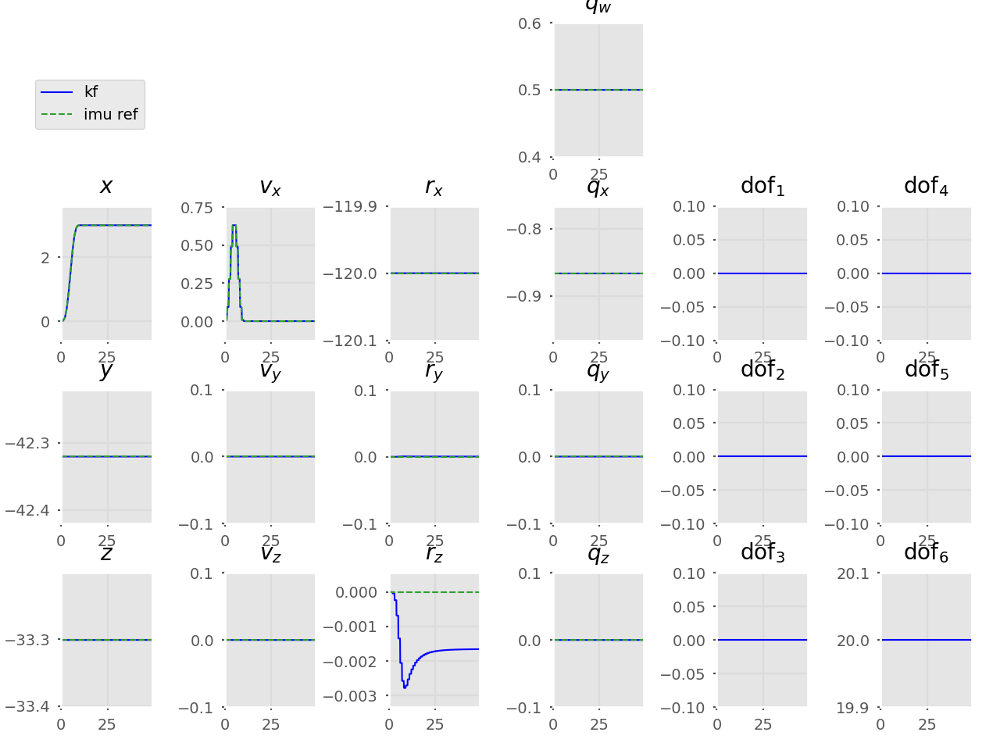 | 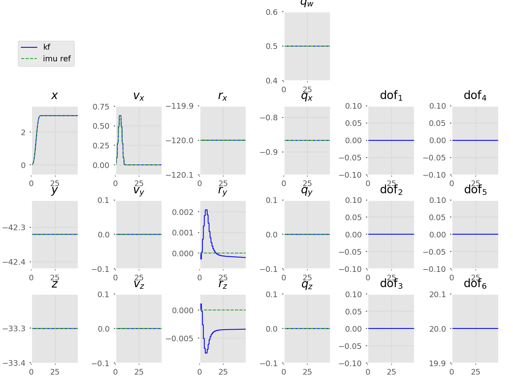
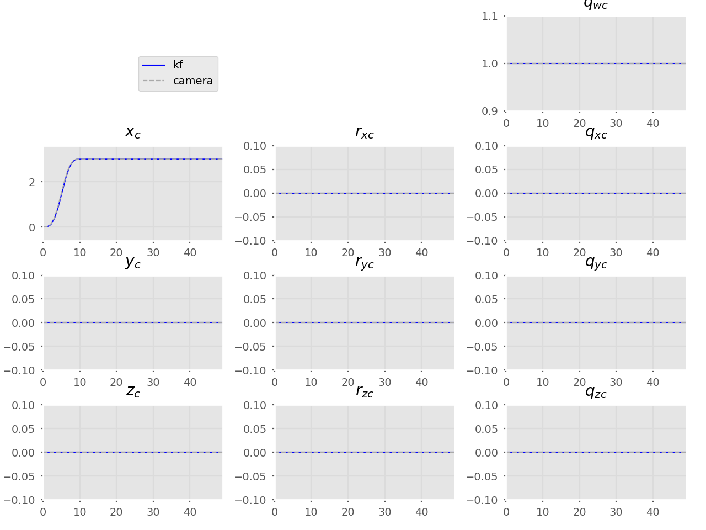 | 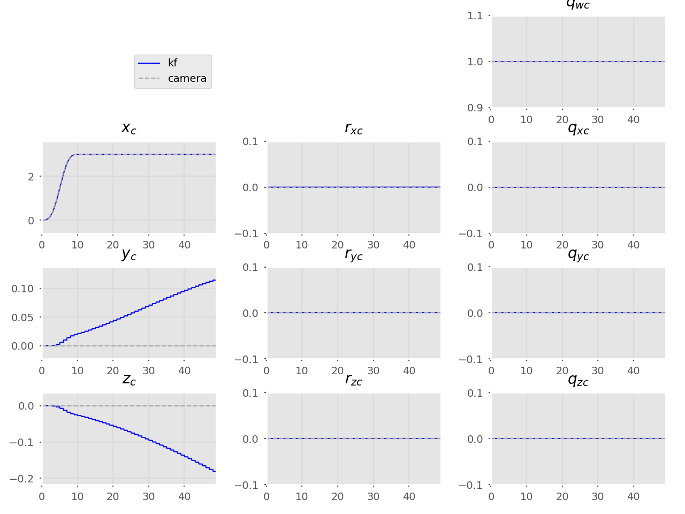 | 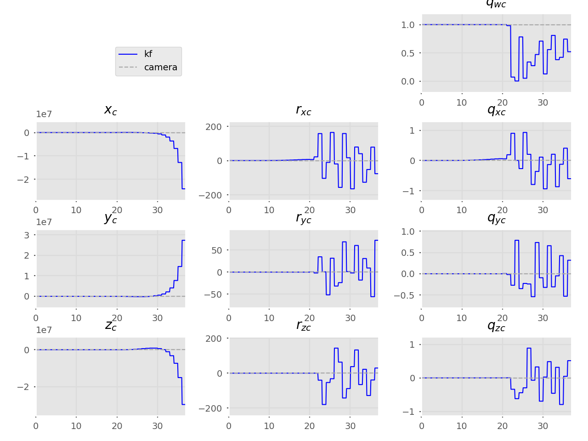

## Probe
```
python3 vsimpleprobe.py
```
Unconstrained SLAM end | Constrained SLAM end
--- | ---
 | 

## Table of contents
* [Probe](#probe)
* [Current results](#current-results-propagation-only)
* [Old tests](/old-tests)
