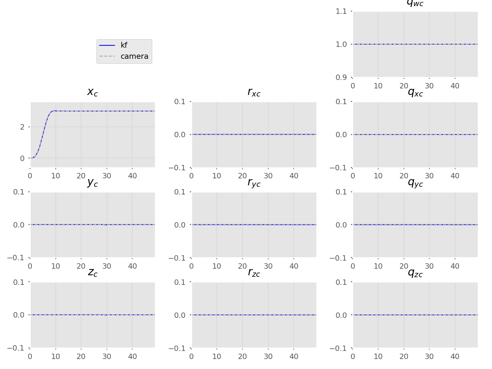
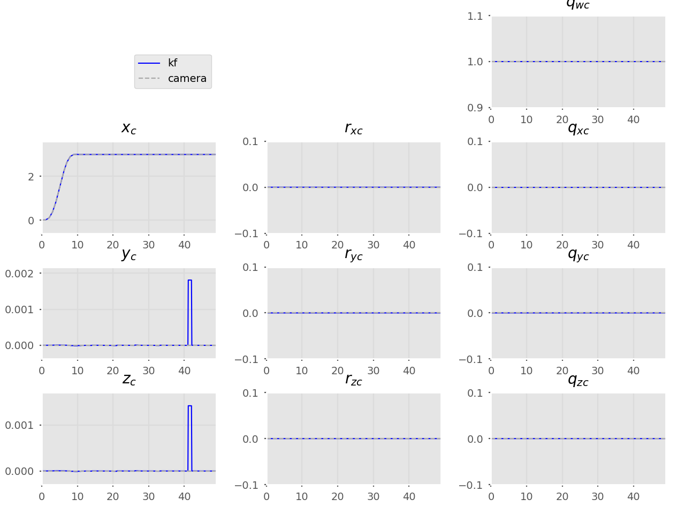
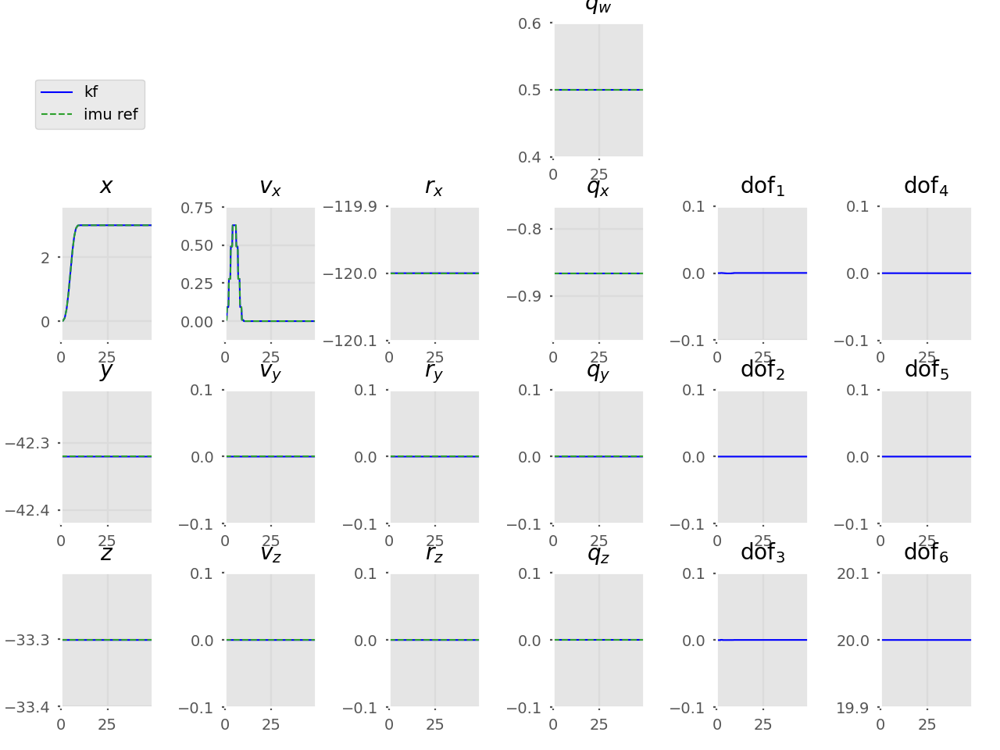

# DVI-EKF
Implementation of a loosely-coupled VI-ESKF SLAM to estimate
the calibration parameters in a camera-IMU sensor probe setup.

[Program outline](https://www.evernote.com/l/AeQSiL2U6txCWbgNAi1G9mUtWune-gjHNlU/)

## Current results
Using `stdev_a, stdev_om = 1e-3`  

### Monocular SLAM trajectory
Prop only plots: [imu](img/kf_mandala0_mono_prop_imu.png) ||
                 [cam](img/kf_mandala0_mono_prop_cam.png)

Only modifying `R_p`:  

**`cov_p = 1000`** | **`cov_p = 0.1`**  | **`cov_p = 1e-3`**
---   | ---   | --- |
`cov_q = 0.5` | `cov_q = 0.5` | `cov_q = 0.5`
 |  | 
 |  | 

Only modifying `R_q`:  

`cov_p = 0.1` | `cov_p = 0.1`  | `cov_p = 0.1`
---   | ---   | --- |
**`cov_q = 1000.0`** | **`cov_q = 0.5`** | **`cov_q = 0.001`**
 |  | 
 |  | 

### Simple trajectory
Camera moves in x direction, no rotations.

Prop only plots: [imu](img/kf_mandala0_trans_x_prop_imu.png) ||
                 [cam](img/kf_mandala0_trans_x_prop_cam.png)

Only modifying `R_p`:  

**`cov_p = 1000`** | **`cov_p = 0.1`**
---   | ---   
`cov_q = 0.5` | `cov_q = 0.5` 
 | 
 | 

Only modifying `R_q`:  

`cov_p = 0.1` | `cov_p = 0.1`  | `cov_p = 0.1`
---   | ---   | --- |
**`cov_q = 1000.0`** | **`cov_q = 0.5`** | **`cov_q = 0.001`**
 |  | 
 |  | 

## Probe
```
python3 old-tests/simple_rotation_anim.py
```
Unconstrained SLAM end | Constrained SLAM end
--- | ---
 | 

## Usage
### Running the program
```
python3 main.py [-f [{0,1}]] [-Rp RP] [-Rq RQ] traj_name prop
```

```
positional arguments:
  traj_name   mandala0_mono, trans_x, rot_x, ...
  prop        do propagation only or do prop + update; ['prop', 'p', 'update',
              'u', 'pu']

optional arguments:
  -h, --help  show this help message and exit
  -f [{0,1}]  fast sim. (only 10 frames)
  -Rp RP      camera position noise (default: 0.1)
  -Rq RQ      camera rotation noise (default: 0.5)
```

### Changing the noise values
* [Process noise - IMU](https://github.com/feudalism/dvi-ekf/blob/95afc6e5996ef68fc3ec3b39d4f063dd8248ce6e/generate_data.py#L35)
* [Process noise - DOFs](https://github.com/feudalism/dvi-ekf/blob/95afc6e5996ef68fc3ec3b39d4f063dd8248ce6e/Filter/Filter.py#L207)

### Setting the Kalman gain plotter
Adjust the arguments in [this line](https://github.com/feudalism/dvi-ekf/blob/95afc6e5996ef68fc3ec3b39d4f063dd8248ce6e/main.py#L40)
as necessary.  
e.g. `min_row, min_col = 0` and `max_row, max_col = 3` will plot the gain matrix entries `K[0:3,0:3]`.

Optional: for plot labels, the boolean option `index_from_zero` [can be set](https://github.com/feudalism/dvi-ekf/blob/95afc6e5996ef68fc3ec3b39d4f063dd8248ce6e/main.py#L85).


