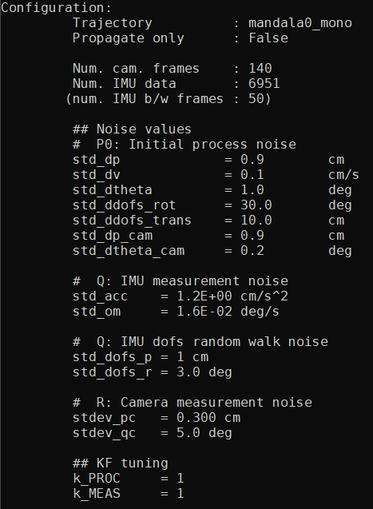

# DVI-EKF
Implementation of a loosely-coupled VI-ESKF SLAM to estimate
the calibration parameters in a camera-IMU sensor probe setup.

[Program outline](https://www.evernote.com/l/AeQSiL2U6txCWbgNAi1G9mUtWune-gjHNlU/)

## Tuning the KF
### Settings
```
py main.py mandala0_mono pu -nb 100 -runs 5
```


### Sensitivity analysis `K_p`
1e-3 | 1
---  | ---
 |
 |

## Old results
Using `stdev_a, stdev_om = 1e-3`  
Monocular SLAM trajectory  

Prop only plots: [imu](img/kf_mandala0_mono_prop_imu.png) ||
                 [cam](img/kf_mandala0_mono_prop_cam.png)

Only modifying `R_p`:  

**`cov_p = 1000`** | **`cov_p = 0.1`**  | **`cov_p = 1e-3`**
---   | ---   | --- |
`cov_q = 0.5` | `cov_q = 0.5` | `cov_q = 0.5`
 |  | 
 |  | 

Only modifying `R_q`:  

`cov_p = 0.1` | `cov_p = 0.1`  | `cov_p = 0.1`
---   | ---   | --- |
**`cov_q = 1000.0`** | **`cov_q = 0.5`** | **`cov_q = 0.001`**
 |  | 
 |  | 

## Usage
```
python3 main.py -h
```
