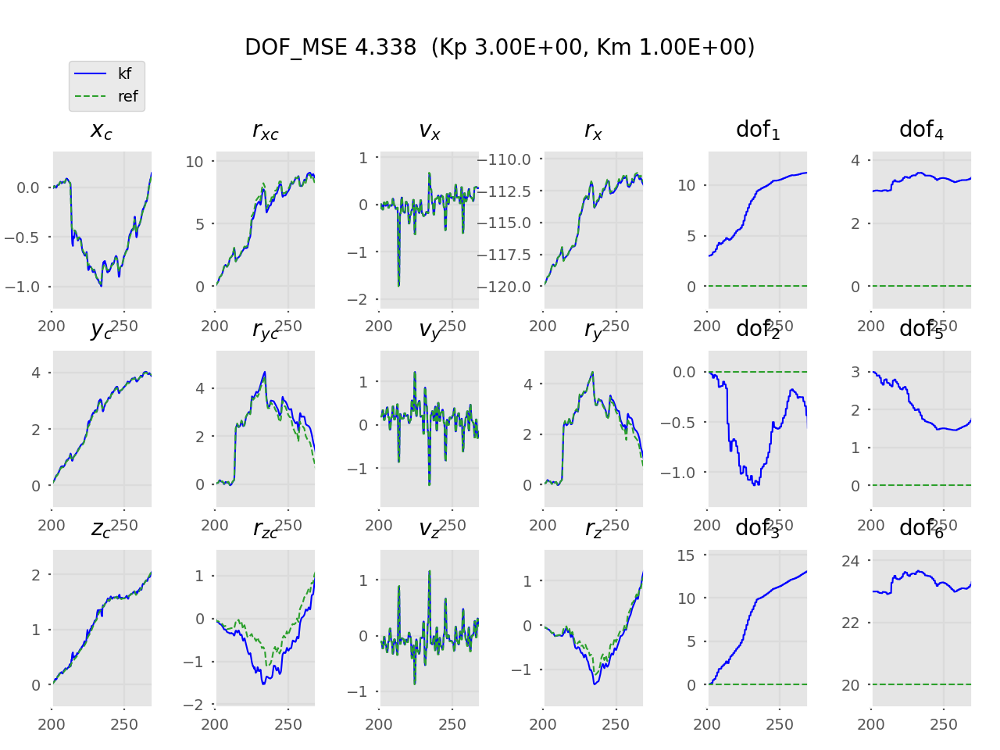
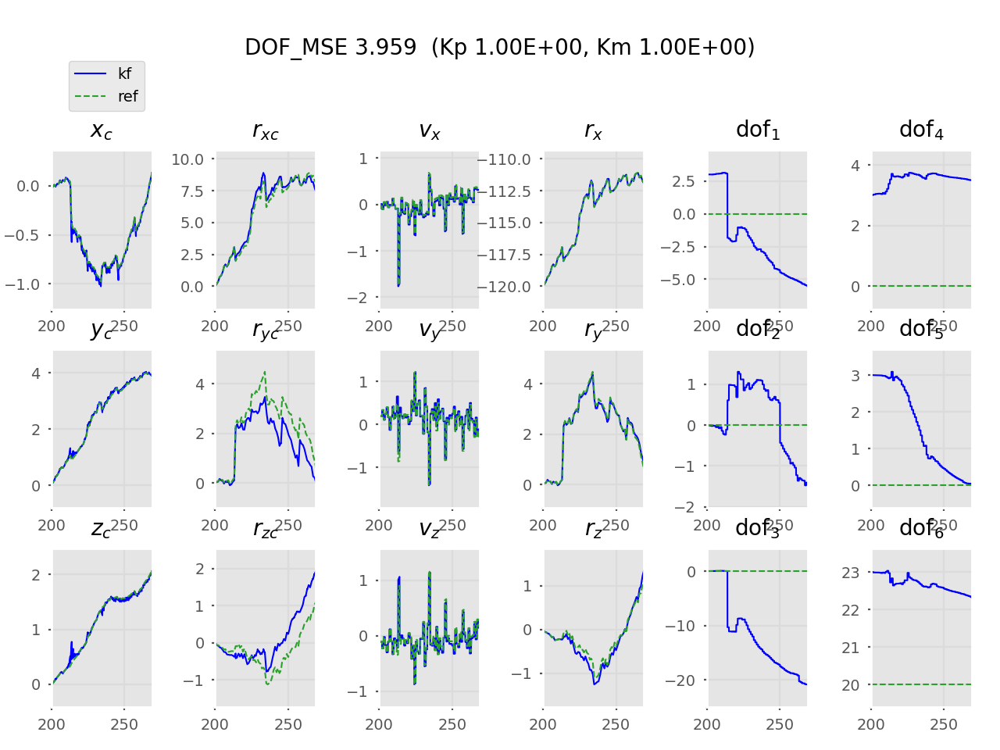
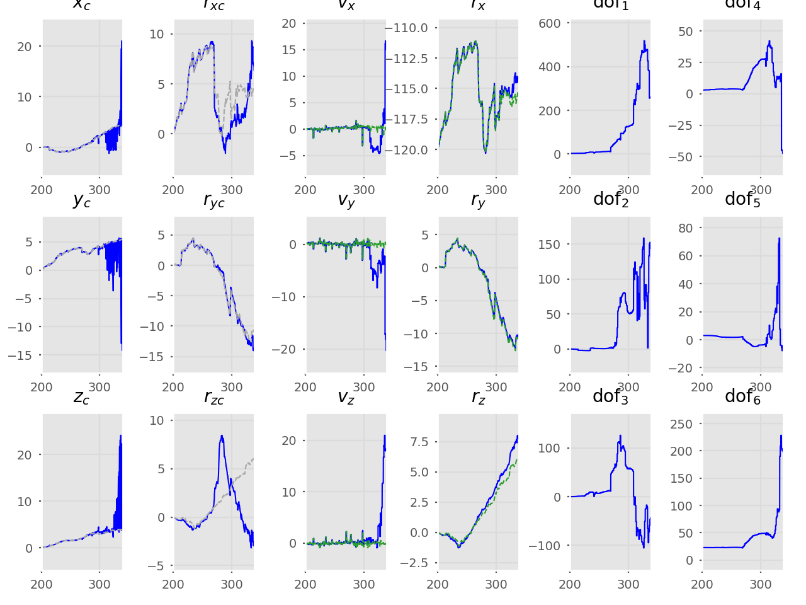
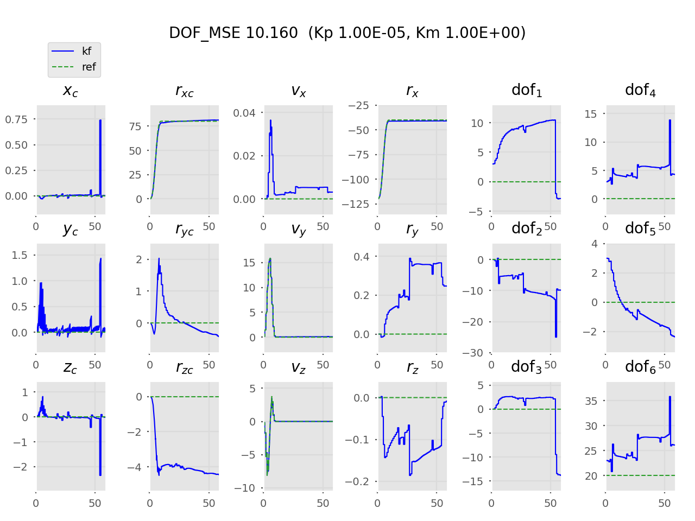
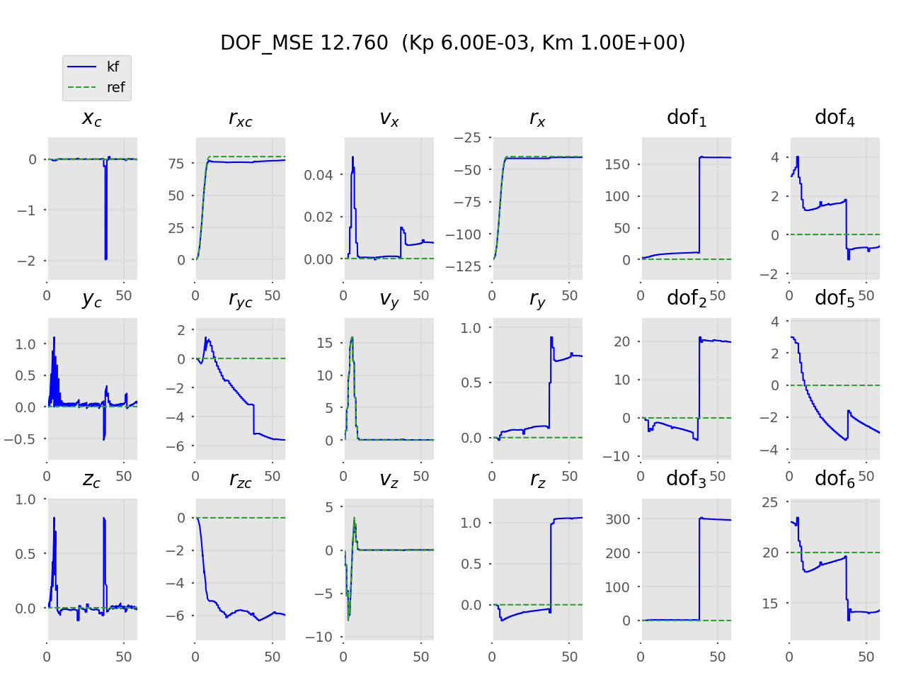
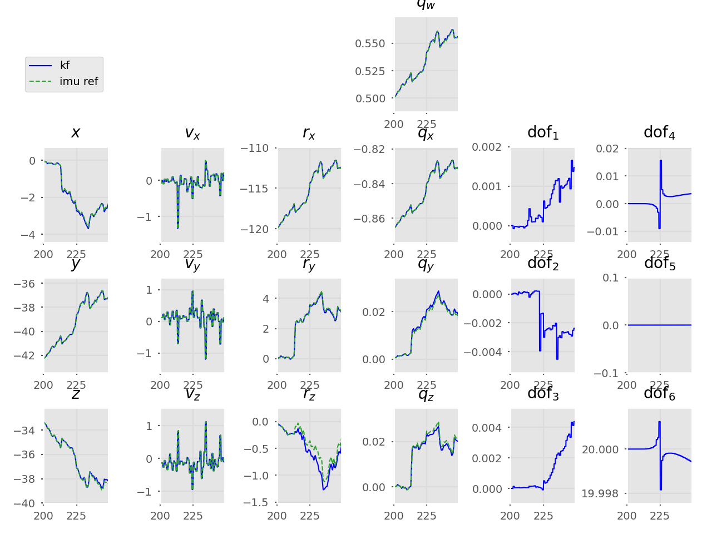
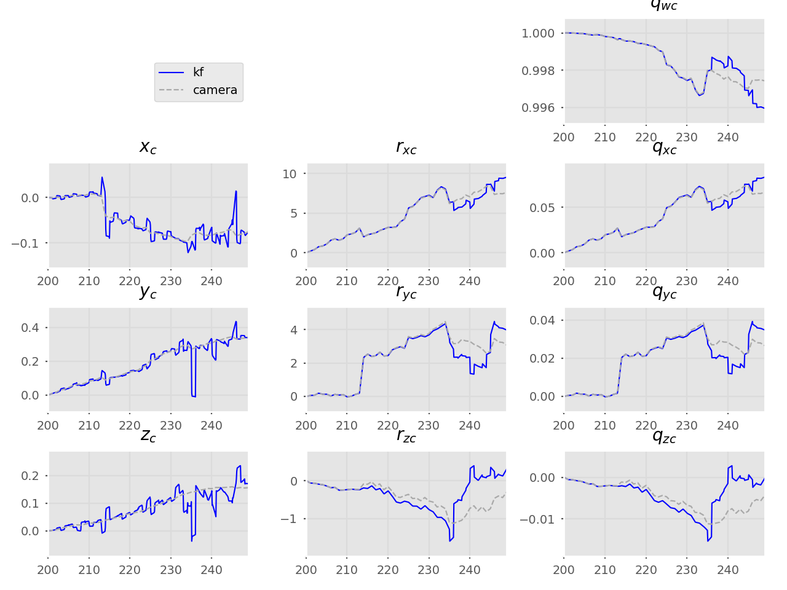
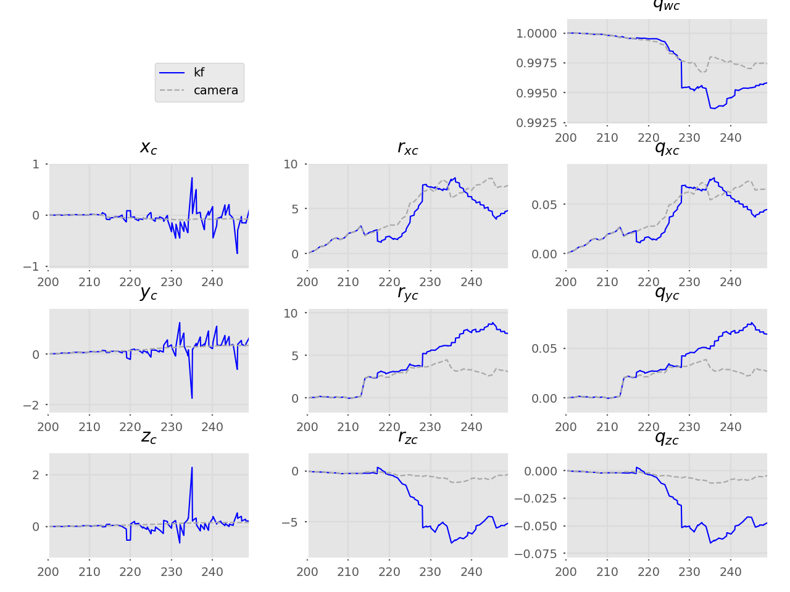

# DVI-EKF
Implementation of a loosely-coupled VI-ESKF SLAM to estimate
the calibration parameters in a camera-IMU sensor probe setup.

[Program outline](https://www.evernote.com/l/AeQSiL2U6txCWbgNAi1G9mUtWune-gjHNlU/)

## Freeze + tune Kp
Kp = 1e-3 * 6 | Kp = 3
--- | ---
 | 

## Tuning the KF
### Settings
```
py main.py mandala0_mono pu -nc 70 -nb 50 -runs 5
```

```
nc = 70 (half the total frames in mandala0_mono trajectory)
nb = 50 (IMU frequency)
```

```
Configuration:
         Trajectory          : mandala0_mono
         Propagate only      : False

         Num. cam. frames    : 70
         Num. IMU data       : 3451
        (num. IMU b/w frames : 50)

         ## Noise values
         #  P0: Initial process noise
         std_dp             = 0.9        cm
         std_dv             = 0.1        cm/s
         std_dtheta         = 1.0        deg
         std_ddofs_rot      = 30.0       deg
         std_ddofs_trans    = 10.0       cm
         std_dp_cam         = 0.9        cm
         std_dtheta_cam     = 0.2        deg

         #  Q: IMU measurement noise
         std_acc    = 1.2E+00 cm/s^2
         std_om     = 1.6E-02 deg/s

         #  Q: IMU dofs random walk noise
         std_dofs_p = 0.02 cm
         std_dofs_r = 0.1 deg

         #  R: Camera measurement noise
         stdev_pc   = 0.300 cm
         stdev_qc   = 5.0 deg
```

### Sensitivity analysis `K_p`
#### mandala0_mono
**Note**: uses old metric (averaged error across whole trajectory)

1e-4 | 1e-3 | 1   | 2
---  | --- | --- | ---
4.9 | 2.9 | 3.96 | 48.7
 | | |  |

#### rot_x
```
python3 main.py rot_x -nb 50 -runs 3
```
1e-5 | 1e-3 * 6 | 1e-2 | 1   | 2
---  | ---      | ---  | --- | --
10.2 | 12.8     | 3.2  | 6.6 | 8.9
 |  |  |  | 

```
     Num. cam. frames    : 60
     Num. IMU data       : 2951
    (num. IMU b/w frames : 50)

     ## Noise values
     #  P0: Initial process noise
     std_dp             = 0.9        cm
     std_dv             = 0.1        cm/s
     std_dtheta         = 1.0        deg
     std_ddofs_rot      = 30.0       deg
     std_ddofs_trans    = 10.0       cm
     std_dp_cam         = 0.9        cm
     std_dtheta_cam     = 0.2        deg

     #  Q: IMU measurement noise
     std_acc    = 1.2E+00 cm/s^2
     std_om     = 1.6E-02 deg/s

     #  Q: IMU dofs random walk noise
     std_dofs_p = 0.005 cm
     std_dofs_r = 0.0200 deg

     #  R: Camera measurement noise
     stdev_pc   = 0.300 cm
     stdev_qc   = 5.0 deg
```

## Old results
Using `stdev_a, stdev_om = 1e-3`  
Monocular SLAM trajectory  

Prop only plots: [imu](img/kf_mandala0_mono_prop_imu.png) ||
                 [cam](img/kf_mandala0_mono_prop_cam.png)

Only modifying `R_p`:  

**`cov_p = 1000`** | **`cov_p = 0.1`**  | **`cov_p = 1e-3`**
---   | ---   | --- |
`cov_q = 0.5` | `cov_q = 0.5` | `cov_q = 0.5`
 |  | 
 |  | 

Only modifying `R_q`:  

`cov_p = 0.1` | `cov_p = 0.1`  | `cov_p = 0.1`
---   | ---   | --- |
**`cov_q = 1000.0`** | **`cov_q = 0.5`** | **`cov_q = 0.001`**
 |  | 
 |  | 

## Usage
```
python3 main.py -h
```
