# DVI-EKF
Implementation of a loosely-coupled VI-ESKF SLAM to estimate
the calibration parameters in a camera-IMU sensor probe setup.

[Program outline](https://www.evernote.com/l/AeQSiL2U6txCWbgNAi1G9mUtWune-gjHNlU/)

## Current results
```
python3 main.py <prop/update> nonoise
```

### Simple trajectory
Camera moves in x direction, no rotations.

Propagation only | Propagation + Update
--- | ---
&nbsp;  | `R_p = 1e3`  
&nbsp;  | `R_q = 0.05` 
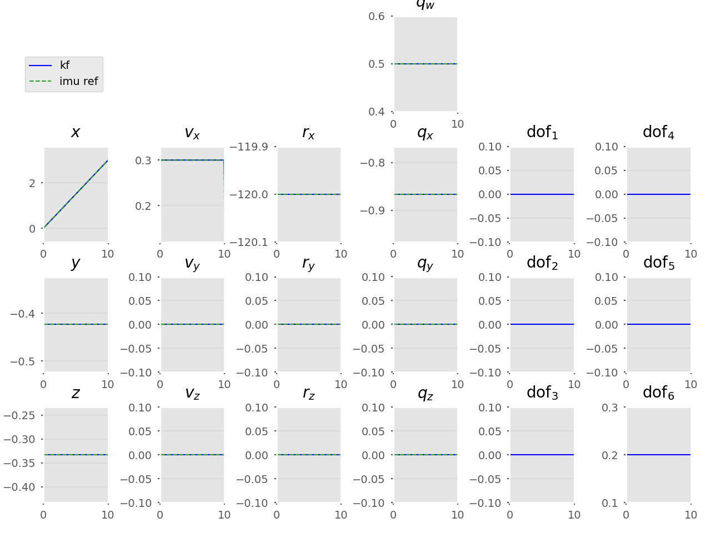 | 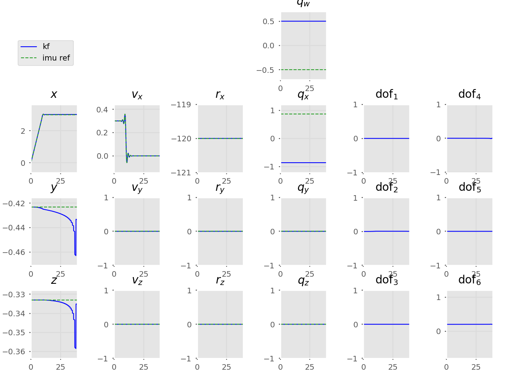
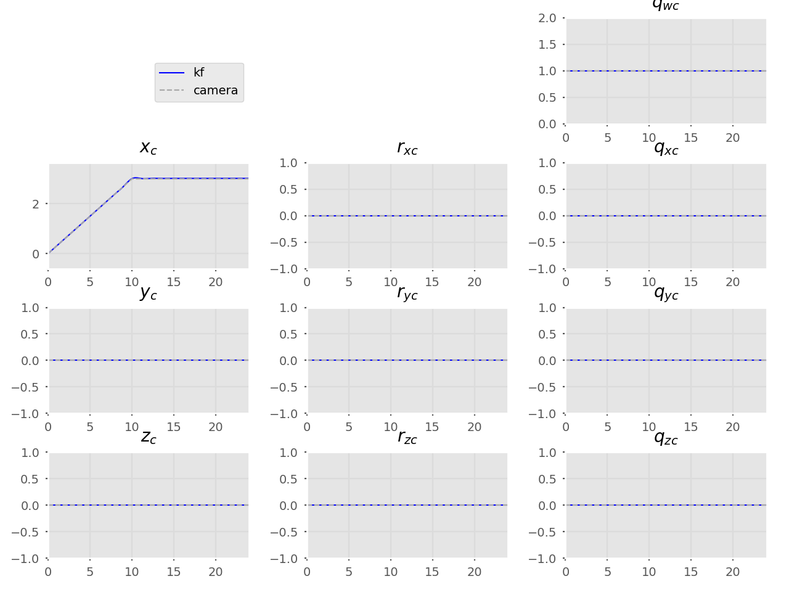 | 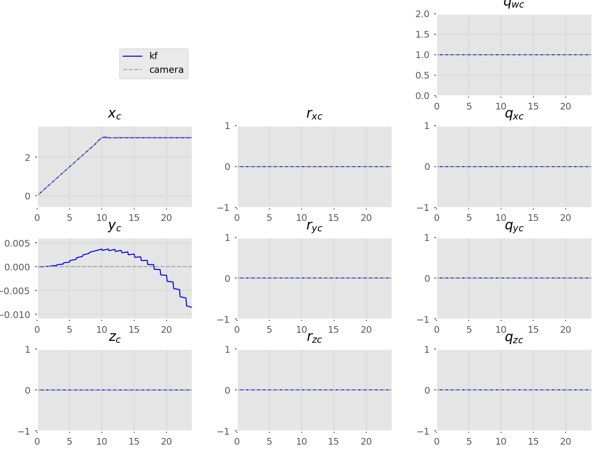

### Monocular SLAM trajectory
P only  | P + U | P + U | P + U
---     | ---   | ---   | --- |
&nbsp;  | `stdev_a, stdev_om = 1e-3`  | `stdev_a, stdev_om = 1e-3` | `stdev_a, stdev_om = 1e-3`  
&nbsp;  | **`cov_p = 1000`** | **`cov_p = 0.1`**  | **`cov_p = 1e-6`**
&nbsp;  | `cov_q = 0.05` | `cov_q = 0.05` | `cov_q = 0.05`
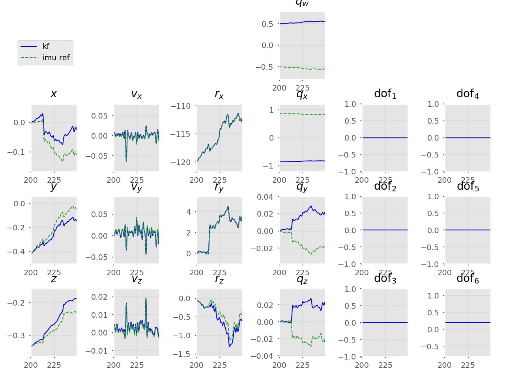 | 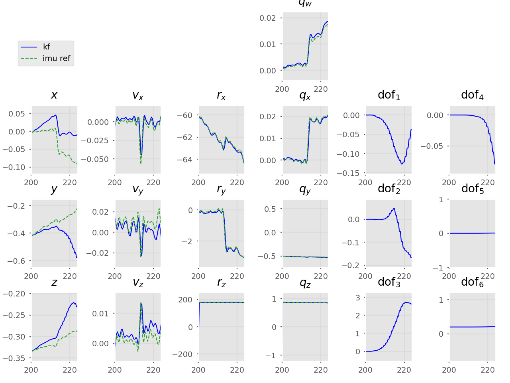 | 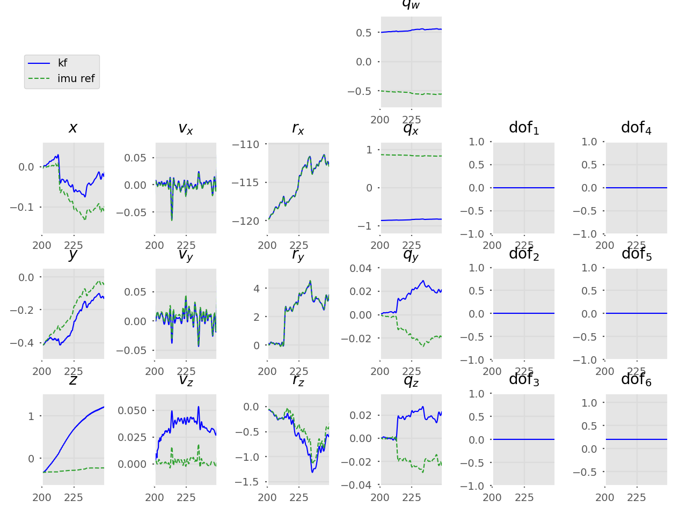 | 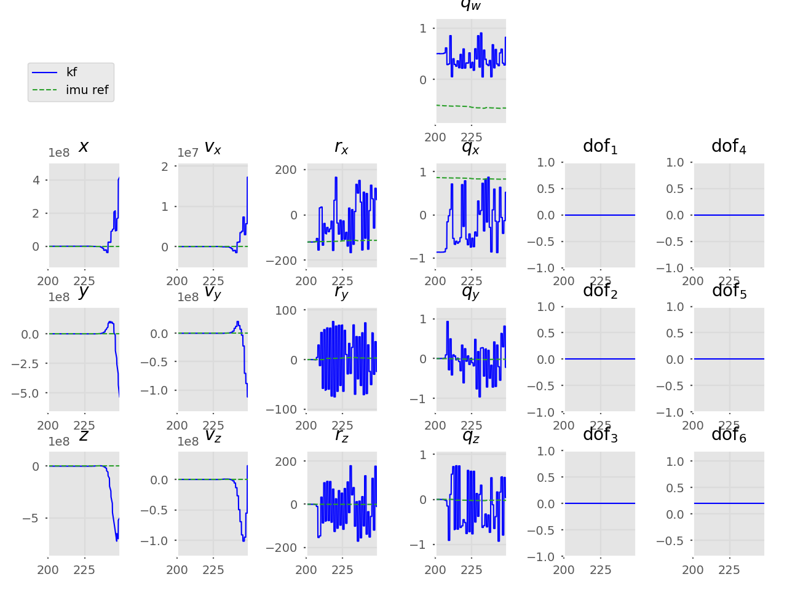
 | 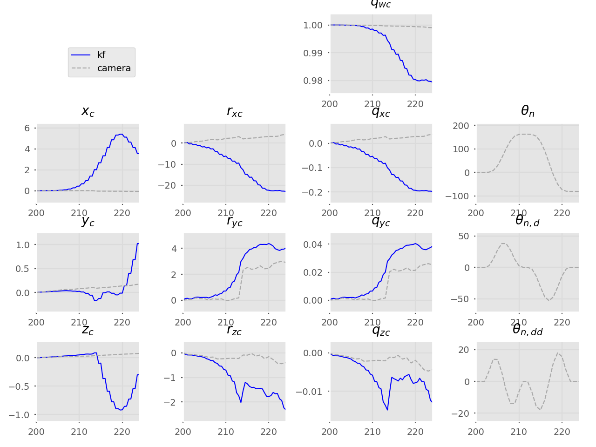 | 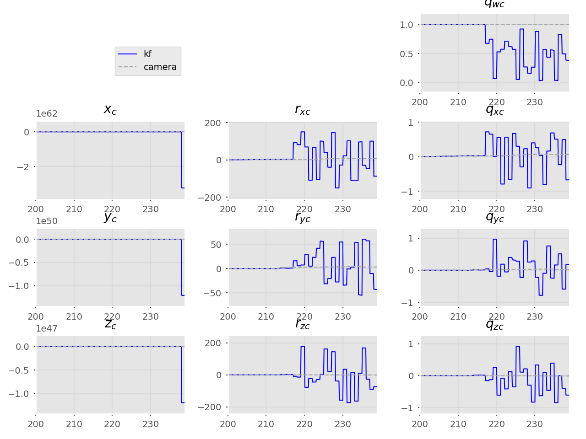 | 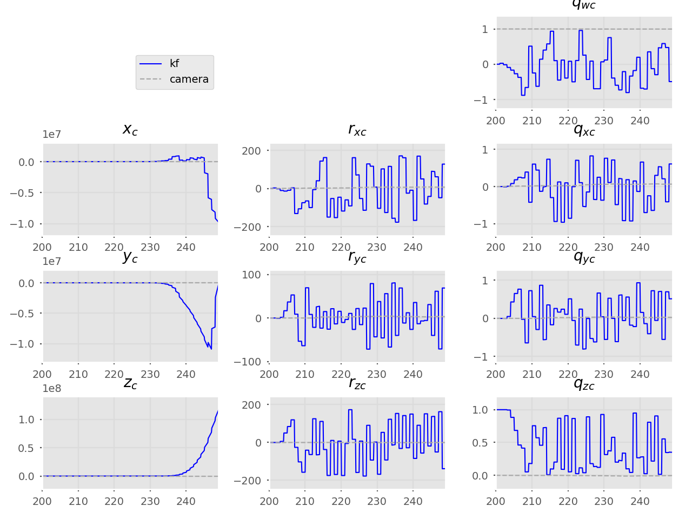

## Probe
```
python3 vsimpleprobe.py
```
Unconstrained SLAM end | Constrained SLAM end
--- | ---
 | 

## Table of contents
* [Probe](#probe)
* [Current results](#current-results-propagation-only)
* [Old tests](/old-tests)
