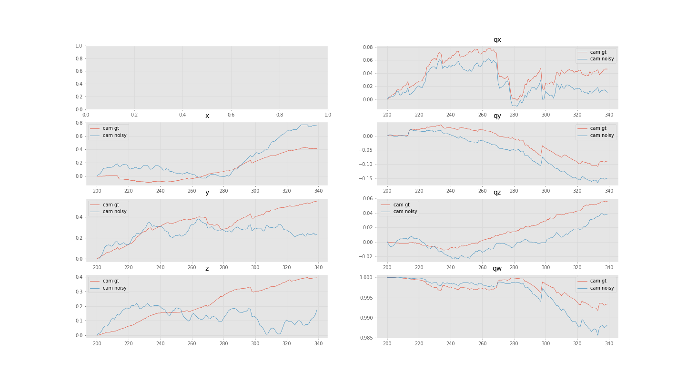
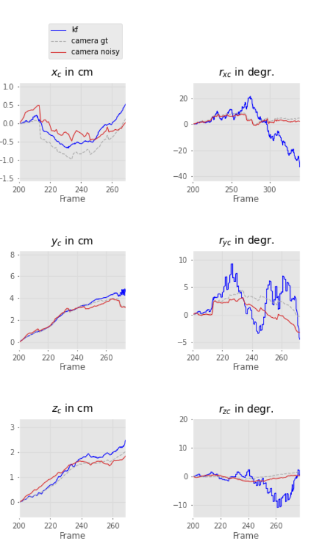
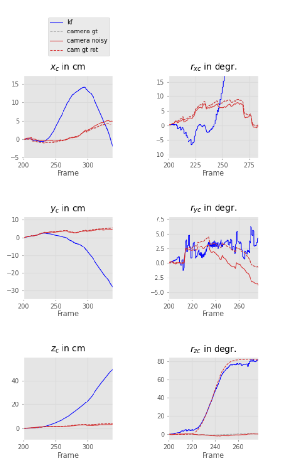
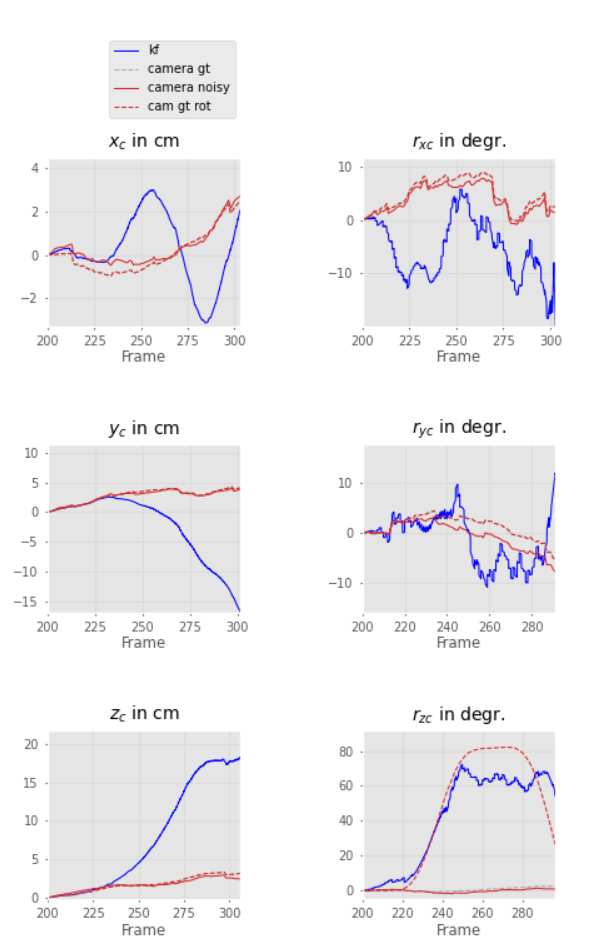
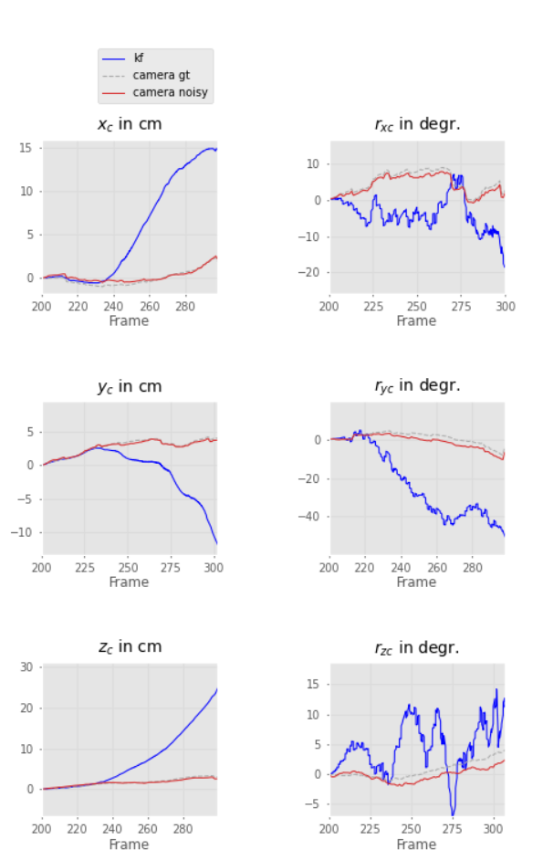
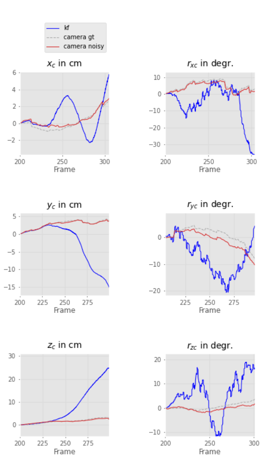
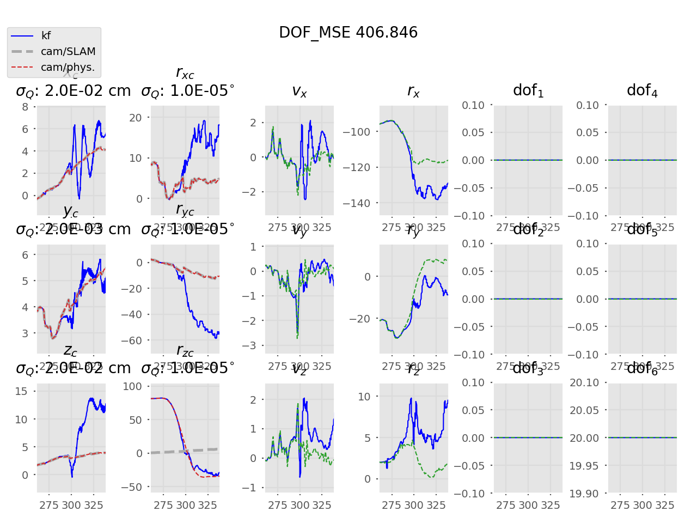
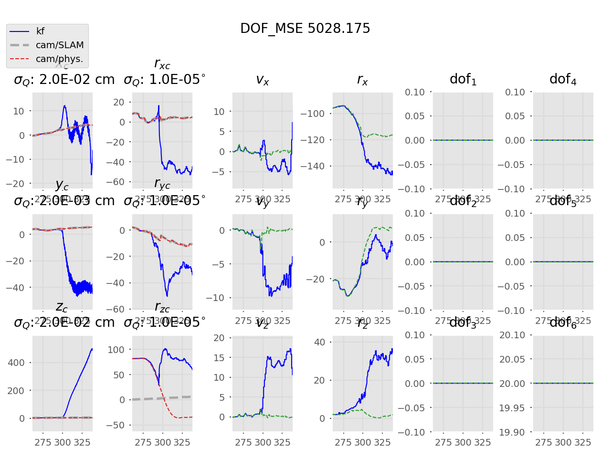

# DVI-EKF
Implementation of a loosely-coupled VI-ESKF SLAM to estimate
the calibration parameters in a camera-IMU sensor probe setup.

[Program outline](https://www.evernote.com/l/AeQSiL2U6txCWbgNAi1G9mUtWune-gjHNlU/)

## Noisy cam


### IMU -> GT convergence


### With notch
~ | ~ | ~
--- | --- | ---
on |  | 
off |  | 


## Notch
### Prop + Update
Tuning in progress


### Start at a later frame (260)
`nb`| _  
--- | ---
10 | 
30 | 
60 | 

### Notch vs. without notch
Update stage: corrected camera measurements vs. uncorrected

`nb` | With notch | Without notch
-- | -- | --
10 |  | 
30 |  | 
60 |  | 

### Propagation only  


* Introduction of constant acceleration model for the notch dofs (imperfect model!)
* Errors of the imperfect model get propagated
* Update stage should try and get the Kalman filter output (blue lines) back to the reference values
    if tuned properly

## Usage
```
python3 main.py -h
```
