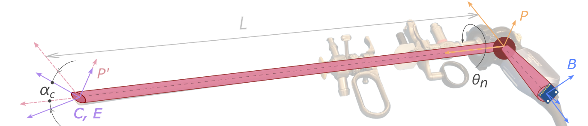

# DVI-EKF
[](https://github.com/psf/black)

Implementation of a loosely-coupled VI-ESKF SLAM to estimate
the calibration parameters in a cystoscopic camera-IMU sensor setup.

  
  


## Usage
1. Configure settings in `config.yaml`
2. Run  
    ```
    python3 main.py 
    ```
